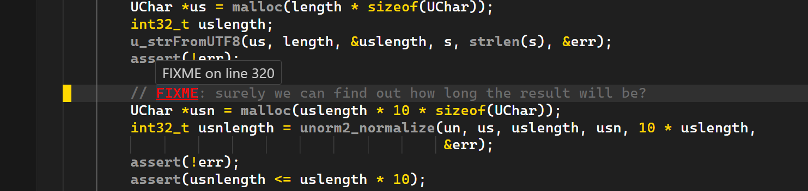
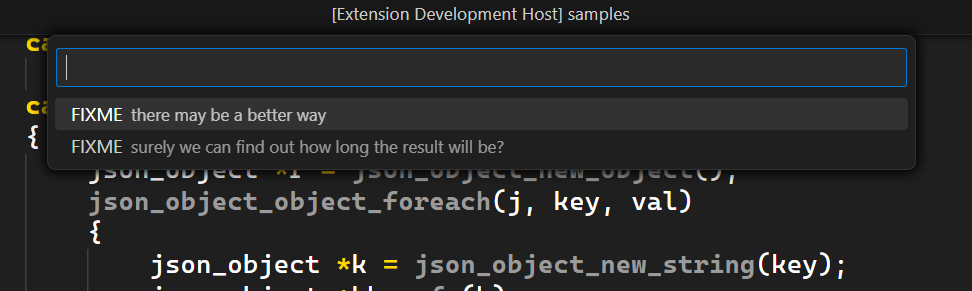

	<h1>Todoed</h1>

	

 

    
    
    

	

### 🗒️ Todoed is a simple extension to highlight keywords like TODO, FIXME, NOTE... I have added some options to modify the keywords their colors.

### ❗ If you find any bugs or have suggestions, fell free to report it [here](https://github.com/Gael-Lopes-Da-Silva/TodoedVSCode/issues/new/choose). This would help me a lot.

## ⚙️ Options
### 🗒️ Todoed has 2 command available right now. `Todoed: Toggle Hightlight` that turn on or off the highlight and `Todoed: List Keywords` that give you a list of all keywords in the document and their position.

~~~json
{
	"todoed.keywords": { // Keywords and thier color
		"CRITICAL": "#FF0000",
		"DEBUG": "#FF0000",
		"DEPRECATED": "#808080",
		"ERROR": "#FF0000",
		"FIXME": "#FF0000",
		"HACK": "#FF00FF",
		"INFO": "#0000FF",
		"NOTE": "#0000FF",
		"OPTIMIZATION": "#008000",
		"REFACTOR": "#FF00FF",
		"REVIEW": "#0000FF",
		"SECURITY": "#FF0000",
		"TODO": "#FF0000",
		"WARNING": "#FFA500"
	},
	"todoed.bold": true, // Enable or disable bold font
	"todoed.underline": true, // Enable or disable underline text decoration
}
~~~

## 🖼️ Screenshots

## 🧱 How to build ?
If you want a build of Yellowed you can find it in the release section or in the [build](./build/) folder. Else use `vsce package` in the project folder.

## ❓ How to install ?
To install, open visual studio code and go to the extention menu. Click on the three dots and click on `Install from VSIX` and choose the `todoed-X.X.X.vsix` file. Or just install it on the market place.

### 🗒️ You can find my Visual Studio Code configuraton [here](https://github.com/Gael-Lopes-Da-Silva/MyVscodeConfig).
